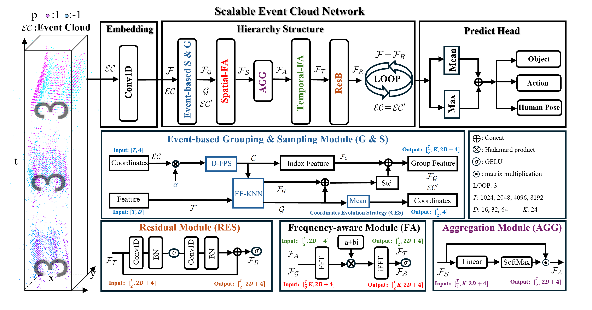
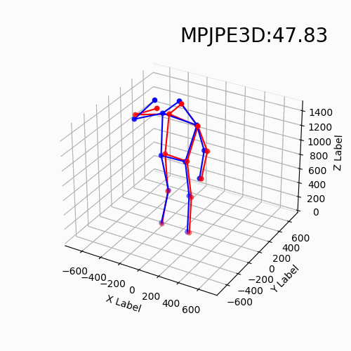
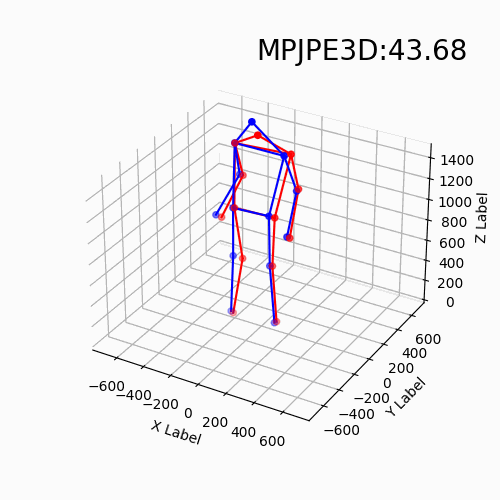
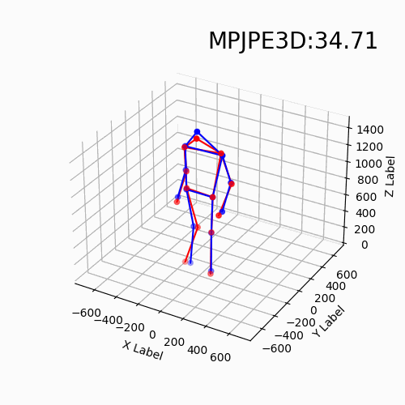
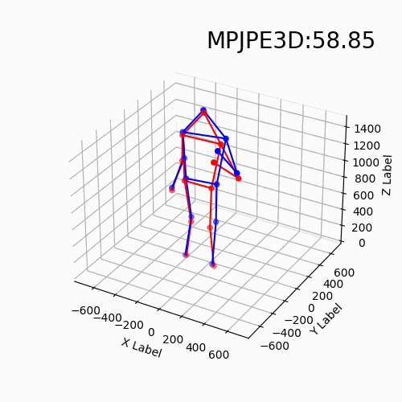

## [Scalable Event Cloud Network for Visual Recognition](https://arxiv.org/abs/2412.20803)

### Installation

    conda create -n secnet python=3.8
    conda activate secnet
    conda install pytorch==2.1.0 torchvision==0.16.0 torchaudio==2.1.0 pytorch-cuda=12.1 -c pytorch -c nvidia
    conda install h5py,tqdm,scikit-learn,tensorboard
    pip install spikingjelly
    optional: install the cuda kernel: https://github.com/erikwijmans/Pointnet2_PyTorch

### Usage
1. Prepare the data:

        cd dataprocess
        python generate_xxx.py

2. Put the train.h5 and test.h5 to ./data/xxx/:

3. Modify the num_class, data_path, log_name and others.

4. Run the train script:
    
        python train_frequency.py

### Configuration

| Dataset              | PointNumber | Dimension     | Group            | Accuracy |
| -------------------- | ------- | ------------- | ---------------- | -------- |
| N-MNIST           | 4096      | 32  | 512  | 0.997    |
| N-CARS           | 8192      | 64  | 512  | 0.947   |
| CIFAR10-DVS           | 10240      | 64  | 2048  | 0.757    |
| N-Caltech101           | 8192      | 64  | 2048  | 0.824    |
| ASL-DVS           | 4096      | 32  | 1024  | 0.999    |
| DVSGesture           | 1024      | 64  | 512  | 0.989    |
| DailyDVS             | 8192    | 64 | 1024 | 0.9965    |
| UCF101-DVS   | 8192 | 64 | 1024    |   0.916       |
| THU-E-ACT              | 8192      | 64 | 1024 | 0.9725    |
| DHP19              | 4096      | 64 | 512 | 6.11/69.89    |

### Download

| Dataset    | Split    | Processed Data |
| ---------- | -------- | -------- |
| N-MNIST | offical  |  [DOWNLOAD](https://pan.baidu.com/s/1SjqO_LWoiInhmQt_sbdJGQ?pwd=DVSG)|
| N-CARS    | offical | [DOWNLOAD](https://pan.baidu.com/s/1SaMAmesC8YCUroVUdHcimQ?pwd=DVSG)|
| CIFAR10-DVS  | filename  |  [DOWNLOAD](https://pan.baidu.com/s/1Mii9BZlZf-EqUOogcXJZqA?pwd=5dp1)  |
| N-Caltech101    | filename    | [DOWNLOAD](https://pan.baidu.com/s/1plQ7YyjxYRq14wWvrZu10Q?pwd=u6m1)|
| ASL-DVS     | filename    | [DOWNLOAD](https://pan.baidu.com/s/16LJmiED7ISiMNr0eS-KknA?pwd=ca96)   |
| DVSGesture     | offical     | [DOWNLOAD](https://pan.baidu.com/s/1zKfIAiPdjFEfq_JHdJN39Q?pwd=DVSG)|
| DailyDVS        |  filename   | [DOWNLOAD](https://pan.baidu.com/s/1HOS4L13d8iC0K_8mc0c5xw?pwd=DVSG)|
| UCF101-DVS       | filename     |[DOWNLOAD](https://pan.baidu.com/s/1CuwZzJNsFupnv5X7Q5JqFA?pwd=DVSG)|
| THU-E-ACT        | offical     | [DOWNLOAD](https://pan.baidu.com/s/1LJZekxP3joI-Y2jY5Uuy3A?pwd=DVSG) |
| DHP19 | offical     |   [DOWNLOAD](https://pan.baidu.com/s/1esEUjGwgbw-aGPmW1BDVkA?pwd=DVSG)|

For DHP19, please refer https://github.com/MasterHow/EventPointPose to prepare processed dataset. For CIFAR10-DVS and N-Caltech101, we first train SECNet on single sliding window, then train a simple classifier to get the results cross a sample.

### Citation
If you find our work useful in your research, please consider citing:

        @inproceedings{ren2026scalable,
          title={Scalable Event Cloud Network for Event-based Classification},
          author={Ren, Hongwei and Ma, Fei and Fang, Yuetong and Huang, Hongxiang and Zhou, Yue and Huang, Yulong and FU, Haotian and Yang, Ziyi and Jiang, Youxin and Wu, Xiangqian and others},
          booktitle={Forty-third International Conference on Machine Learning},
          year={2026}
        }

and this paper is related to our previous three works [EventMamba](https://arxiv.org/abs/2405.06116), [TTPOINT](https://dl.acm.org/doi/abs/10.1145/3581783.3612258?casa_token=z72pohcxZTAAAAAA:pO42EmMVOEp-8PJPx4WBUwJyjrs-K2Z7lkWbZsanCTF72u763LuxdWNPYAXuTKUT4g82yPgPgLbLH6I) and [PEPNet](https://openaccess.thecvf.com/content/CVPR2024/html/Ren_A_Simple_and_Effective_Point-based_Network_for_Event_Camera_6-DOFs_CVPR_2024_paper.html):

    @article{ren2024rethinking,
    title={Rethinking Efficient and Effective Point-based Networks for Event Camera Classification and Regression: EventMamba},
    author={Ren, Hongwei and Zhou, Yue and Zhu, Jiadong and Fu, Haotian and Huang, Yulong and Lin, Xiaopeng and Fang, Yuetong and Ma, Fei and Yu, Hao and Cheng, Bojun},
    journal={arXiv preprint arXiv:2405.06116},
    year={2024}
    }
    @inproceedings{ren2023ttpoint,
    title={Ttpoint: A tensorized point cloud network for lightweight action recognition with event cameras},
    author={Ren, Hongwei and Zhou, Yue and Fu, Haotian and Huang, Yulong and Xu, Renjing and Cheng, Bojun},
    booktitle={Proceedings of the 31st ACM International Conference on Multimedia},
    pages={8026--8034},
    year={2023}
    }
    @inproceedings{ren2024simple,
    title={A Simple and Effective Point-based Network for Event Camera 6-DOFs Pose Relocalization},
    author={Ren, Hongwei and Zhu, Jiadong and Zhou, Yue and Fu, Haotian and Huang, Yulong and Cheng, Bojun},
    booktitle={Proceedings of the IEEE/CVF Conference on Computer Vision and Pattern Recognition},
    pages={18112--18121},
    year={2024}
    }    

### Acknowledgment
Thanks to the previous works, PointNet, PointNet++, PointMLP, [EventPointPose](https://github.com/MasterHow/EventPointPose) and STNet.
